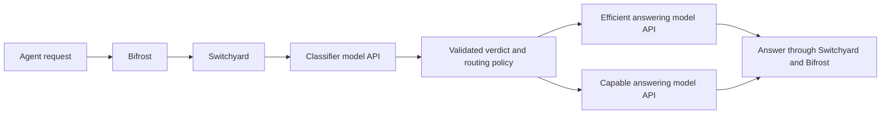

# Self-hosted model routing: discussion and design notes

Discussion recorded on 2026-09-28. This document separates the working experiment
from proposals that still need implementation or evaluation. See
[RESULTS.md](RESULTS.md) for measurements and [README.md](README.md) to reproduce
the Docker setup. Credentials and account responses are intentionally omitted.

## Objective and constraints

Choose an efficient answering model for tasks it can handle and a more capable
model for difficult work. The intended workload includes long agent sessions,
potentially around 150k tokens, with tool calls and changing task difficulty.
The final deployment must run inference entirely on company infrastructure.
OpenRouter was authorized for this experiment; it is a temporary backend, not
the intended production inference dependency. Builds, services, and probes run
inside Docker.

The useful prediction is whether a particular model can complete the next unit
of work successfully with the available context, tools, and budget. A universal
difficulty label is less useful: the same task can be easy for one model and hard
for another. A short message can also continue a difficult earlier task.

## What Bifrost community already provides

The inspected checkout contains a semantic complexity classifier in
[`plugins/routing/complexity`](../../../plugins/routing/complexity), an optional
LLM fallback, routing rules, and session-aware behavior. Its
[complexity-router documentation](../../../docs/features/governance/complexity-router.mdx)
describes embedding user text and matching labeled reference phrases to produce
Simple, Medium, or Complex tiers. The LLM fallback runs after semantic
classification produces no tier; it is not a standalone primary LLM judge just
by omitting embedding configuration.

This code establishes that community routing support exists. It does not
establish classification accuracy on our model pair or agent workloads. Embedding
similarity can confuse subject matter with the actual work required. An LLM can
consider more semantics, but its verbal confidence also needs evaluation. A
trained small classifier is another possible solution; classification does not
inherently require a generative LLM at inference time.

Related approaches discussed include learned model preferences in
[RouteLLM](https://arxiv.org/abs/2406.18665), answer cascades in
[FrugalGPT](https://arxiv.org/abs/2305.05176), and managed routing such as
[Microsoft Foundry's model router](https://learn.microsoft.com/en-us/azure/foundry/openai/concepts/model-router-how-it-works).
These establish different ways to trade cost against quality. They do not supply
a ready-made accuracy guarantee for our models and traffic.

## What Switchyard contributes

Switchyard is a routing engine. In our `llm_classifier` / `capability` setup it
first calls a separate judge through an OpenAI-compatible HTTP client. The judge
returns a structured verdict; deterministic policy selects the answering model;
Switchyard then calls that model and proxies the answer through Bifrost.

The experiment uses Qwen3 30B A3B Instruct as the judge, Qwen3.5 9B as the
efficient model, and Qwen3.5 397B A17B as the capable model, all through OpenRouter.
Each classified request therefore makes a judge call followed by an answer call.
With `classify_trigger = "user_turn"` and session identity, tool continuations
reuse the chosen model and skip the judge. A request ending in user text can
trigger classification again, including a replay of the same user request.

Switchyard handles verdict validation, thresholds, session decisions, protocol
translation, proxying, and telemetry. It also offers other routing strategies,
including signals derived from tool results and agent progress. Its integration
value is real, but some proxy infrastructure overlaps with Bifrost. It does not
automatically supply a model-specific capability assessment, calibrated
probabilities, or long-context summarization.

Bifrost required only a custom-provider configuration, private-address access for
the Docker service, and session-header forwarding. No Go runtime changes were
needed. Both answer tiers were observed in live API responses; selection was
checked against the returned model and selected-model header.

## Scores, accuracy, and more aggressive promotion

The capability judge returns `p_solve`, `capability_boundary`, `primary_rule`, and
`crux`. The score is an estimated probability of success for the smaller model;
higher values favor that model. It is not a universal difficulty score. The
packaged prompt describes a generic efficient agent, so the forecast should not
be treated as calibrated evidence about Qwen3.5 9B.

The policy chooses the small model when its score meets or exceeds the relevant
threshold. Our original base is 0.75, with a step of 0.10. A stricter candidate
uses a base of 0.97 and a step of 0.01:

| Boundary | Original minimum score for small | Candidate minimum score for small |
| --- | ---: | ---: |
| Supported | 0.75 | 0.97 |
| Uncertain or unmatched | 0.85 | 0.98 |
| Unsupported | 0.95 | 0.99 |

The candidate satisfies `base_threshold + 2 * threshold_step <= 1` and passed
configuration validation in Docker. Replaying the captured scores keeps the
translation on small and moves the concurrency and graph tasks to big. A base
of exactly 0.95 would still accept the graph task's 0.95 supported verdict.
The candidate is archived in
[`evidence/routes.threshold-candidate.toml`](evidence/routes.threshold-candidate.toml);
the default running route remains unchanged.

Increasing thresholds changes model selection without another judge call. It
does not improve the judge's probability estimates. In the live experiment, the
graph task received a high score but the small model produced an incorrect
negative-cycle rule. The larger baseline included the necessary reachability
conditions. This is a concrete failure to retain for future evaluation, not a
general ranking of the two models.

A model-specific judge prompt can describe supported work and failure cases.
Thresholds and examples should be chosen on representative evaluation data,
then checked on held-out tasks. Hard cases need a capable fallback, and success
criteria must cover correctness rather than simply a lower large-model call rate.
See the pinned [classifier policy and prompt documentation](https://github.com/NVIDIA-NeMo/Switchyard/blob/64def5647b711c3c3ce2840ed4feb42c85cea6db/docs/routing_algorithms/llm_classifier_routing.md).

## Latency: what the five seconds meant

Eight classifier calls in the initial batch averaged 5.236 s, ranging from
2.242 to 10.125 s. That is the complete remote Qwen judge call through OpenRouter,
including communication, intermediary/provider processing, queueing, prompt
processing, and generation. It is not Switchyard's local routing overhead. A GPU
on the gateway machine would not accelerate inference still running remotely.

Three later non-inference OpenRouter requests took 460–577 ms with fresh
connections; DNS/TCP/TLS accounted for 294–321 ms. This control does not measure
OpenRouter's onward inference-provider connection. It cannot establish that most
of the earlier five seconds was network time, or be subtracted directly from
the earlier measurements. Exact attribution remains unmeasured.

Public observations discussed were:

| Source | Setup | Reported latency | Limits of comparison |
| --- | --- | ---: | --- |
| [LangChain evaluation](https://www.langchain.com/blog/switchyard-agent-routing-benchmark) | Gemini 3.1 Flash Lite judge, Switchyard escalation mode | About 700 ms per judged turn | Different model, provider, and routing mode |
| [Contributor report, issue #723](https://github.com/NVIDIA-NeMo/Switchyard/issues/723) | Azure-hosted LLM decision | 1,653 ms mean | Ten deliberately separable cases, one run each |
| Same contributor report | TypeSafe `jev-latest` decision | 281 ms mean | Exploratory comparison, not a production accuracy benchmark |

These results show that five seconds is not a fixed requirement of Switchyard.
They do not predict the latency of a self-hosted judge on our hardware. Official
[soak-test guidance](https://nvidia-nemo.github.io/Switchyard/operations/soak_test/)
describes comparing the same backend directly and through the router to isolate
overhead; configured mock delays are not measured model latency.

## Jev and the self-hosting requirement

Jev was considered because fast, structured decisions are well suited to routing.
The discussion did not identify a verified official downloadable model or
self-hosted inference package. A locally running SDK or integration would still
depend on its hosted inference endpoint. That does not satisfy the final
deployment constraint. This is the status of our investigation, not a permanent
claim that a private or future deployment option cannot exist.

The promising idea is a fast, accurate decision model. Jev's small published
smoke comparison does not settle accuracy on long agent trajectories. Any future
Jev evaluation would need confirmed deployment rights and a genuinely local
inference option before it could become a production dependency.

## Context for long agent conversations

The context given to a routing judge and the context given to the answering model
are separate choices. Our classifier uses the opening user task plus the last
six messages; this does not truncate the answer model's request to six messages.
The window can expand to retain related tool-call/result pairs. It limits message
count, not tokens, so a single tool dump can still be large.

At the pinned Switchyard revision, the judge builder installs its own system
instructions, excludes the client's system/developer instructions, drops
provider-private reasoning, and does not copy the client's tool definitions.
Increasing `recent_turn_window` can retain more conversation messages, but does
not forward the complete original request. An adaptation is needed if the judge
must assess system constraints and available tools too. See
[task input selection](https://github.com/NVIDIA-NeMo/Switchyard/blob/64def5647b711c3c3ce2840ed4feb42c85cea6db/crates/libsy/src/algorithms/llm_class.rs)
and [judge request construction](https://github.com/NVIDIA-NeMo/Switchyard/blob/64def5647b711c3c3ce2840ed4feb42c85cea6db/crates/libsy/src/algorithms/util/llm_judge.rs).

There is no established universal industry convention. The inspected
[RouteLLM controller](https://github.com/lm-sys/RouteLLM/blob/main/routellm/controller.py)
uses the last message and acknowledges its first-turn training limitation.
Switchyard supports an opening/latest-message view or a recent window.
[Microsoft's agent routing documentation](https://learn.microsoft.com/en-us/azure/foundry/openai/how-to/model-router-agents)
describes analysis of the full request, including history, instructions, and tools;
it does not disclose the exact internal preprocessing.

An economical starting point is a maintained task summary, constraints, latest
user message, and relevant recent tool results. The message "continue" alone
does not reveal that an agent is investigating a difficult concurrency problem.
However, summaries can omit decisive evidence, and a full conversation is worth
evaluating when local inference and prefix caching make it affordable.

## Proposed full-context local judge with prefix caching

The company proposal is to run a fast small model locally and repeatedly send it
the full conversation for classification. If the conversation grows by appending
messages and the prefix remains cached, later judge calls can reuse the prior
prompt computation. The first call pays for the full context; later calls process
the newly appended material and generate a short verdict. This makes full-history
judging a plausible alternative to summary-based judging. It has not been deployed
or benchmarked in this experiment.

[vLLM automatic prefix caching](https://docs.vllm.ai/en/latest/features/automatic_prefix_caching/)
supports repeated long documents and multi-round conversations. It saves prefill
work; it does not eliminate decoding, request transmission, or all attention work
associated with a long context. The selected model must support the context and
retain useful long-context judgment quality.

The cache plan needs these properties:

- Preserve a stable judge prompt and append conversation content. Rewriting early
  messages, changing a summary near the start, or sliding a window can invalidate
  much of the reusable prefix.
- Keep the relevant cache available on the serving instance, or provide a cache
  sharing mechanism. Replica changes and eviction can produce cold requests.
- Budget KV-cache memory for concurrent long sessions. A fast short-prompt model
  does not imply fast or memory-efficient 150k-token service.
- Distinguish the judge's cache from the answer model's cache. The same weights
  with different leading instructions generally create different prefixes; a
  cache warmed by answering does not automatically warm classification. Cache
  state also cannot simply transfer between different models.
- Keep the verdict compact and validate it. In the current design a successful
  small-model routing decision is still followed by a separate answer request.

These prefix-matching and eviction considerations follow the
[vLLM cache design](https://docs.vllm.ai/en/latest/design/prefix_caching/). Actual
reuse must be measured after Switchyard's request conversion and the serving
engine's chat template, rather than inferred from similar JSON text.

Full context may improve the evidence available to the judge. It does not
guarantee fewer large-model calls: seeing missed constraints may appropriately
increase them. The objective is lower total serving cost at an acceptable task
success rate. More small-model decisions alone would not demonstrate success.

## Architecture choices and next evaluation

The current Switchyard sidecar is a working experimental platform. For a final
deployment, compare keeping it with integrating a local classifier into Bifrost's
routing path. Reuse existing Bifrost routing components where practical. A direct
integration could keep provider execution, governance, and accounting in Bifrost;
it would still need context selection, session policy, failure handling, and
evaluation. No such plugin or decision-only integration is implemented here.

The next useful experiment would compare the recent-window, maintained-summary,
and full-history judge inputs on the same agent trajectories and candidate models.
Measure:

1. Task success, especially difficult tasks incorrectly routed to small, with
   fixed-small and fixed-big baselines and a held-out evaluation set.
2. Judge latency and token counts for cold and warm sessions at several context
   lengths, including 150k tokens where the chosen model supports it.
3. Prefix-cache hits, cache memory, and tail latency under concurrent sessions,
   compaction, replica changes, and eviction.
4. End-to-end cost and latency including judge calls, both answer models, retries,
   and the loss or reuse of answer-model caches when switching tiers.
5. Failures, tool-loop continuity, and the ability to reclassify when task state
   changes. `user_turn` currently holds the model through the intervening tool loop.

Until those measurements exist, the evidence supports integration feasibility and
a testable local-caching proposal. It does not establish production routing
quality, a latency target, or the need to retain Switchyard permanently.
